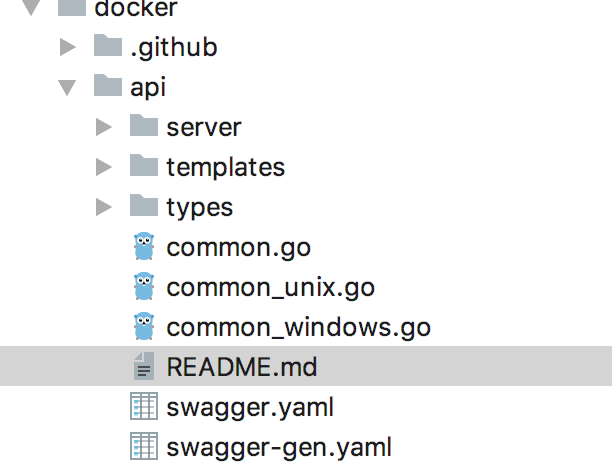

## 剖析api

#### api包结构如下：



- `api/swagger.yaml` 定义了Restful API接口，可以通过https://editor.swagger.io/# 进行查看
- `api/types/`定义了client和server相关的对象
- `api/server/`实现一个http server供client cli调用
- `cli/` command-line client
- `client/` docker go client包，被cli或其他go程序调用来与daemon进行交互
- `daemon/` 提供具体的API功能逻辑实现

因此，整个交互模块为：

**cli -> client ---Restful API---> api server -> daemon**

## Restful API

规范为：`/images/(name)/push`

API通过swagger.yaml查看API resource，即docker对象：
- `container`
- `image`
- `network`
- `volume`
- `exec`
- swarm
- node
- service
- task
- secret
- config
- `plugin`
- system
- distribution
- session

其中：关于swarm的概念我们可以忽略，我们使用k8s：
- swarm
- node
- service
- task
- secret
- config

## server
docker engine使用[gorilla/mux](https://github.com/gorilla/mux)进行http URL路由和调度
入口在`github.com/docker/docker/api/server.go`

```go
type Server struct {
	cfg           *Config
	servers       []*HTTPServer
	routers       []router.Router
	routerSwapper *routerSwapper
	middlewares   []middleware.Middleware
}
```
