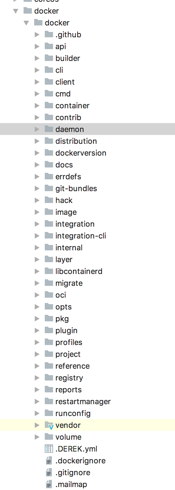

---
layout: post
title: 1-架构和代码结构
category: docker
tags: [docker, 源码]
keywords: docker
---

## Docker Engine

Docker Engine使用client-server的架构设计来提供服务，其中:
                       
- docker daemon作为常驻进程作为server来提供服务（dockerd命令来运行）.
                       
- docker client作为客户端使用命令行接口（CLI）来和服务端交互(docker命令).

- docker daemon提供Restful API提供接口与client进行通信.

docker daemon创建和管理的主要docker object包括：
- images
- containers
- networks
- volumes

**也就是说，docker干的活就是围绕images、containers、networks、volumes.**

## Docker architecture

### Docker架构图

- Client通过docker命令对docker daemon发起请求
- Docker Host跑着常驻进程docker daemon，接受请求进行处理docker object
- Registry存放镜像

### docker object

- images
- containers
- networks
- volumes
- plugins

## Docker源码结构

根据docker的设计和架构，docker源码结构大致为：

- client
- daemon
- registry

其中，daemon作为server，肯定包括通信模块，加上docker object，再次拆分：
- client
- daemon
- api
- image
- container
- volume
- registry
- plugin

